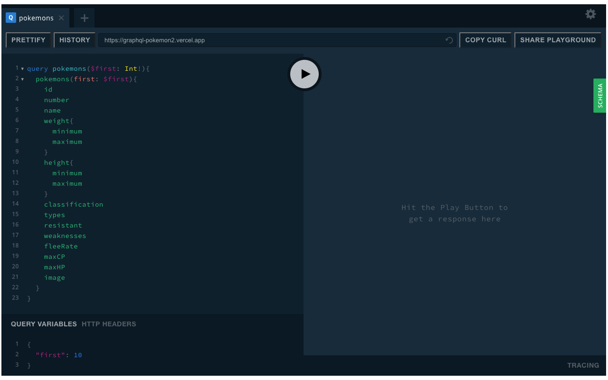

# chrome-graphql-playground
Chrome extension for [GraphQL Playground](https://github.com/prisma/graphql-playground). Running the GraphQL Playground as an extension overcomes CORS issues that occur when loading it from the web (you're able to call any GraphQL endpoint). From the "Settings" screen, setting the `request.credentials` option to `include` allows you to pass cookie credentials to any GraphQL endpoint that requires it.

